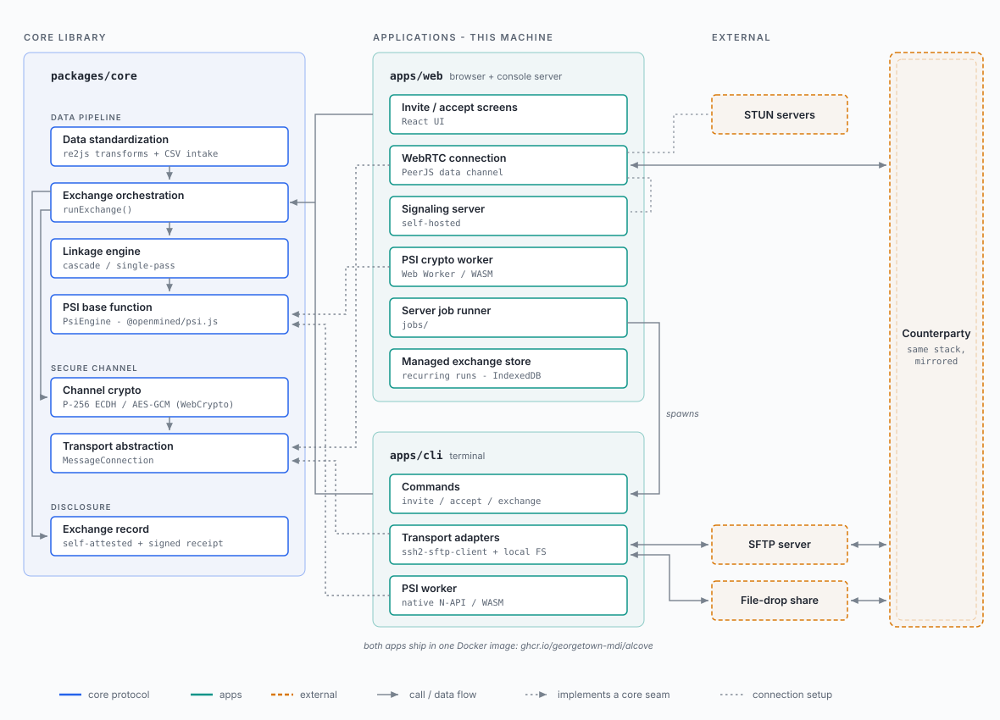

# Alcove documentation

Alcove is a privacy-preserving record linkage (PPRL) tool that enables partner agencies to identify shared members across administrative datasets without revealing anything about the records they do not have in common. It implements a private set intersection (PSI) protocol available both as a browser-based web application and a containerized CLI, and is designed to work within the policy and infrastructure constraints typical of government agencies.

## Role-based reading guide

| I am a... | Start with... | Then read... |
|-----------|--------------|--------------|
| Analyst running one exchange in the browser | [WEB_APP.md](WEB_APP.md) | [MANAGED_EXCHANGE.md](MANAGED_EXCHANGE.md), for running it again on a schedule |
| Partner who received an invitation | [WEB_APP.md](WEB_APP.md#accepting-an-invitation) | [PRIVACY.md](../PRIVACY.md) |
| Program officer evaluating the software | [DESIGN.md](DESIGN.md) | [SECURITY_DESIGN.md](SECURITY_DESIGN.md), [COMPLIANCE.md](COMPLIANCE.md) |
| Security reviewer or auditor | [SHARED_RESPONSIBILITY.md](SHARED_RESPONSIBILITY.md) | [SECURITY_DESIGN.md](SECURITY_DESIGN.md), [PROTOCOL.md](spec/PROTOCOL.md), [CHANNEL_SECURITY.md](spec/CHANNEL_SECURITY.md), [COMPLIANCE.md](COMPLIANCE.md) |
| Compliance officer | [COMPLIANCE.md](COMPLIANCE.md) | [PRIVACY.md](../PRIVACY.md), [SECURITY_DESIGN.md](SECURITY_DESIGN.md) |
| Privacy reviewer | [PRIVACY.md](../PRIVACY.md) | [COMPLIANCE.md](COMPLIANCE.md), [SECURITY_DESIGN.md](SECURITY_DESIGN.md) |
| IT professional operationalizing an exchange | [CLI.md](CLI.md) | [EXCHANGE_REFERENCE.md](EXCHANGE_REFERENCE.md), [DEPLOYMENT.md](DEPLOYMENT.md) |
| Operator running one exchange from a graphical console on their own machine | [CONSOLE.md](CONSOLE.md) | [CLI.md](CLI.md), [EXCHANGE_REFERENCE.md](EXCHANGE_REFERENCE.md) |
| Operator running a recurring exchange from the browser | [MANAGED_EXCHANGE.md](MANAGED_EXCHANGE.md) | [SECURITY_DESIGN.md](SECURITY_DESIGN.md), [MANAGED_EXCHANGE_RECORD.md](spec/MANAGED_EXCHANGE_RECORD.md) |
| Developer contributing to the project | [DESIGN.md](DESIGN.md) | [PROTOCOL.md](spec/PROTOCOL.md), [COMMUNICATION.md](COMMUNICATION.md), [FILE_SYNC.md](spec/FILE_SYNC.md), [CONTRIBUTING.md](../CONTRIBUTING.md), [TESTING.md](TESTING.md) |
| Maintainer upgrading a pinned dependency | [CONTRIBUTING.md](../CONTRIBUTING.md#dependency-policy) | [DEPENDENCY_PINS.md](spec/DEPENDENCY_PINS.md), [PREBUILD_REVENDOR.md](PREBUILD_REVENDOR.md) |
| Partner agency whose IT staff run the command line app | [CLI.md](CLI.md#your-first-recurring-exchange) | [EXCHANGE_REFERENCE.md](EXCHANGE_REFERENCE.md) |

## Glossary

Each concept has one official word, listed below, and the screens, messages and guides use it. A sentence may use another wording where the context makes clear what it means, and comes back to the official word where a reader may have lost track; not every mention has to match. Configuration keys, command-line flags, environment variable names and code keep their own names.

| Word | What it names | Where it is set |
|------|---------------|-----------------|
| Alcove | This software, on either side of an exchange | - |
| partner | The other party to an exchange; "you" and "your" are this party | - |
| invitation | What one party sends the other to set up an exchange: the proposed terms, a short-lived secret, and optionally where to meet. It is sent as a link to the web app or as text to paste | `alcove invite`, `alcove accept`, `alcove exchange --invitation` ([CLI.md](CLI.md#invitations)) |
| quick exchange | An exchange with no invitation and no shared secret, run against a server or shared folder both parties already agreed on | `alcove URL INPUT_FILE`, or the console's quick exchange; `--save` keeps its settings ([CLI.md](CLI.md#quick-exchange)) |
| shared folder | The folder both parties read and write when an exchange runs through files: a network share or a synced folder | `connection.channel: filedrop` with [`connection.path`](EXCHANGE_REFERENCE.md#connectionpath), or `inbound_path` and `outbound_path`; on the console, `JOB_RENDEZVOUS_DIR` |
| coordination server | The server two parties connect through to start a WebRTC exchange; it passes setup messages and never sees exchange data | `connection.channel: webrtc` with `connection.server`; for the web app, `VITE_SIGNALING_SERVER_URL` ([DEPLOYMENT.md](DEPLOYMENT.md#coordination-server)). Code and the package name call it the broker |
| working folder | The one folder the console mounts, holding an exchange's configuration, key file, input and results. Console screens call it "your folder" | `JOB_DATA_ROOT` ([CONSOLE.md](CONSOLE.md)) |
| exchange record | The file each party keeps of what its exchange disclosed, `alcove-record-<time>.json`, with its verification keys | Written by default; `--no-record` turns it off |
| signed receipt | The file both parties sign at the end of an exchange, `alcove-receipt-<time>.json`: the evidence of the terms both agreed and the data that flowed | [`signing.mode: certificate`](EXCHANGE_REFERENCE.md#signingmode) |

## Document inventory

The documentation is organized in three tiers: this **overview** tier (`docs/`) of conceptual and operational documents; a **technical specification** tier ([`docs/spec/`](spec/README.md)) of wire formats, byte encodings, normative constants, and implementation-level design for implementors and auditors; and a **design notes** tier ([`docs/notes/`](notes/README.md)) of citeable, non-normative design records -- the model behind a mechanism, the options weighed, and the decisions taken. The spec and notes tiers each have their own index.

### Overview (`docs/`)

- [WEB_APP.md](WEB_APP.md) - for an analyst or program staff member at either party running one exchange in the browser: creating or accepting an invitation, reading the results, keeping and checking the exchange record, and how large an exchange can be
- [MANAGED_EXCHANGE.md](MANAGED_EXCHANGE.md) - for the same reader running that exchange again on a schedule from the browser: saving it, installing the app, the schedule, moving it to another device or the command line, recovering from a failed run, the accounting of disclosures, and backups
- [CLI.md](CLI.md) - for IT staff running exchanges from the command line: a task index, a first recurring exchange step by step, every command, the configuration files, scheduling, recovery, and exit codes
- [EXCHANGE_REFERENCE.md](EXCHANGE_REFERENCE.md) - for IT staff writing or checking an `alcove.yaml`: every field of the exchange configuration file
- [CONSOLE.md](CONSOLE.md) - for an operator trying out one exchange from a graphical console on their own machine before moving it to the command line: running the container, its mounts and settings, and what it hands over
- [DEPLOYMENT.md](DEPLOYMENT.md) - for IT staff hosting Alcove: running the supporting services and deploying the command line app with Docker
- [FIPS_SFTP_PROFILE.md](FIPS_SFTP_PROFILE.md) - for IT staff at an agency required to use FIPS-approved cryptography: the SFTP settings to use, what they exclude, and the host-key gap
- [DESIGN.md](DESIGN.md) - for a program officer or new contributor who wants the whole picture: what Alcove does, its architecture, the exchange configuration in summary, and the user journey
- [SECURITY_DESIGN.md](SECURITY_DESIGN.md) - for a security reviewer: the privacy guarantee of private set intersection, the threat model, authentication, channel security, and key rotation
- [SHARED_RESPONSIBILITY.md](SHARED_RESPONSIBILITY.md) - for a security reviewer or agency IT lead filling in a security questionnaire: what the project is responsible for and what the deploying agency is, per deployment
- [COMPLIANCE.md](COMPLIANCE.md) - for a compliance officer or agency reviewer: regulatory framings, data classification, and what to check
- [COMMUNICATION.md](COMMUNICATION.md) - for a reviewer or contributor who needs to know how an exchange proceeds: the channels, how the two sides stay in step, the web invitation and consent screens, message delivery, error handling, and the supporting services
- [INCIDENT_RESPONSE.md](INCIDENT_RESPONSE.md) - for the maintainer handling a reported vulnerability, behind [SECURITY.md](../SECURITY.md): triage and severity, the private fix and release, the advisory, reporter communication, and the tabletop exercise record
- [RELEASES.md](RELEASES.md) - for the maintainer cutting a release: versioning policy, the release checklist, and publishing the artifacts
- [PREBUILD_REVENDOR.md](PREBUILD_REVENDOR.md) - for the maintainer replacing the vendored native PSI build, and the reviewer checking that work: the two integrity controls, the procedure, and the chain-of-custody steps
- [TESTING.md](TESTING.md) - for a contributor adding or running tests: where a test goes, the integration backends and profiles, the console check, the browser suite, and coverage
- [ROADMAP.md](ROADMAP.md) - for anyone asking what is planned next

### Technical specifications ([`docs/spec/`](spec/README.md))

- [PROTOCOL.md](spec/PROTOCOL.md) - for an implementor or auditor of the matching: the PSI and PSI-C algorithms, linkage, datasets, the steps after linkage, and the P-256 key exchange at the wire level
- [CHANNEL_SECURITY.md](spec/CHANNEL_SECURITY.md) - for an auditor of the transport: the application-layer encryption, the memory and liveness bounds, SFTP crash safety on a fatal packet, and the authenticated abort marker
- [FILE_SYNC.md](spec/FILE_SYNC.md) - for an implementor of the `sftp` and `filedrop` channels: the shared folder as a state machine, the file names, where each rule is enforced, and the preconditions for an exchange
- [WEBRTC_TRANSPORT.md](spec/WEBRTC_TRANSPORT.md) - for an implementor of the `webrtc` channel, where the browser and command line ends must match: the rendezvous roles, the signaling messages, the data-channel framing and close, the ICE list rule, and the transport's limits
- [EXCHANGE_RECORD.md](spec/EXCHANGE_RECORD.md) - for an implementor or auditor of the exchange record: its files, the commitment scheme, the governance metadata, and its privacy properties
- [EXCHANGE_FILE.md](spec/EXCHANGE_FILE.md) - for an implementor of the exchange file the web app downloads: that it is the command line's configuration schema, what the web app guarantees when it writes one, the versioning policy, the invitation channel-binding rule, and how its key file is provisioned
- [DEFAULT_STANDARDIZATION.md](spec/DEFAULT_STANDARDIZATION.md) - for an implementor or auditor of cleaning: the default pipeline per data type when a configuration sets no `standardization`, the rule both parties rely on, and the column-name table behind the inferred defaults
- [CANONICAL_ENCODING.md](spec/CANONICAL_ENCODING.md) - for an implementor computing receipts, record commitments, or the agreed-terms hash: the RFC 8785 byte encoding they are computed over
- [CREDENTIAL_STORAGE.md](spec/CREDENTIAL_STORAGE.md) - for an auditor of files at rest: how the key file, signing identity, exchange record, and result CSV are written owner-only and durably
- [MANAGED_EXCHANGE_RECORD.md](spec/MANAGED_EXCHANGE_RECORD.md) - for an implementor or auditor of recurring web exchanges: the record the browser stores, the save-before-success ordering, the one-owner rule for the secret, and the export file's custody model and format
- [CLI_EVENTS.md](spec/CLI_EVENTS.md) - for a developer driving the command line from another program: the opt-in `--event-stream` output, its framing, event types, error categories, and field sanitization
- [CLI_DOCTOR.md](spec/CLI_DOCTOR.md) - for a developer reading `alcove doctor --json`: the document's fields, its schema version and compatibility rule, the status values, each mode's checks, and the exit codes
- [SERVER_JOB_API.md](spec/SERVER_JOB_API.md) - for a contributor working on the console's server: the job API that runs the command line as a subprocess, its request schema, the SFTP connection the operator authors, the one-exchange-at-a-time lifecycle, the working-folder layout, the event relay, and the startup rules
- [DEPENDENCY_PINS.md](spec/DEPENDENCY_PINS.md) - for the maintainer upgrading the SFTP or WebRTC stack: why they are exact-pinned, what each assumes, the upgrade checklists, and the install-script policy
- [CONTAINER_IMAGES.md](spec/CONTAINER_IMAGES.md) - for an auditor of the shipped images, the standard and the FIPS variant: how each fixes its dependencies to the lockfile, what each pins, what the FIPS provider's CMVP certificate covers, and the measured writable and setuid inventories

### Design notes ([`docs/notes/`](notes/README.md))

Tracked, citeable design records: the model behind a mechanism, the options weighed, and the decisions taken. Nothing here binds an implementation; a note points at the spec for the normative rows. Its [index](notes/README.md) lists each note with its status and holds the maturity ladder from `scratch/` up to the formal tiers.

The web application's interface has its own record outside this tree: [`design/web-redesign/`](../design/web-redesign/README.md) holds the chosen redesign as a non-functional HTML mockup, with the framing, the alternatives weighed, and the civic-design sourcing behind it -- the direction `apps/web/src/exchange/`, `apps/web/src/recurring/` and `apps/web/src/console/` implement.

## System architecture

One library, `packages/core`, holds the protocol; the apps supply what core leaves abstract - the transport channel (`MessageConnection`) and the PSI compute backend (`PsiEngine`). Both apps ship in one Docker image. [DESIGN.md](DESIGN.md) narrates this architecture; the [spec tier](spec/README.md) holds the wire-level detail.
